# 📧 **Professional Email Campaign Manager**

<div align="center">


**🚀 Enterprise-grade email campaign management system**

*Professional bulk email sending with advanced queue management, rate limiting, and intelligent retry mechanisms*

</div>

---

## 📋 **Table of Contents**

- [🎯 What is Email Campaign Manager?](#-what-is-email-campaign-manager)
- [✨ Key Features](#-key-features)
- [🌐 Browser Automation](#-browser-automation)
- [🏗️ System Architecture](#️-system-architecture)
- [🚀 Quick Start](#-quick-start)
- [⚙️ Configuration Guide](#️-configuration-guide)
- [📊 Usage Examples](#-usage-examples)
- [🔧 Advanced Features](#-advanced-features)
- [📁 Project Structure](#-project-structure)
- [🛠️ Troubleshooting](#️-troubleshooting)

---

## 🎯 **What is Email Campaign Manager?**

**Email Campaign Manager** is a sophisticated, enterprise-grade email automation platform designed for professional bulk email campaigns. Built with Python, it provides advanced queue management, intelligent rate limiting, and robust error handling for reliable email delivery at scale.

### 🔍 **Core Capabilities:**

1. **📧 Multi-Provider SMTP** - Support for Gmail, Outlook, Yahoo, and custom SMTP servers
2. **🌐 Browser Automation** - Send emails through web interfaces using Playwright automation
3. **⚡ Intelligent Queue Management** - Smart load balancing across multiple senders
4. **🛡️ Advanced Rate Limiting** - Prevent provider blocking with intelligent throttling
5. **🔄 Retry Mechanisms** - Automatic retry with exponential backoff
6. **📊 Real-time Monitoring** - Comprehensive logging and progress tracking
7. **🎨 Template System** - Professional HTML email templates with personalization
8. **🔀 Dual Mode Support** - Switch between SMTP and browser automation seamlessly

### 🎯 **Perfect For:**
- 📈 **Marketing Campaigns** - Professional email marketing
- 🏢 **Business Outreach** - B2B communication campaigns
- 📧 **Newsletter Distribution** - Regular subscriber communications
- 🔔 **Notification Systems** - Automated system notifications
- 📊 **A/B Testing** - Campaign performance optimization

---

## ✨ **Key Features**

### 🚀 **Enterprise-Grade Performance**
- **Multi-threaded Processing** - Concurrent email sending across providers
- **Smart Queue Distribution** - Optimal load balancing algorithms
- **Rate Limiting Protection** - Prevent SMTP provider blocking
- **Failure Recovery** - Automatic sender failover and retry logic

### 📧 **Advanced Email Management**
- **Template Engine** - Dynamic HTML email generation
- **Personalization** - Custom field replacement and dynamic content
- **Attachment Support** - File attachments with CID embedding
- **Email Validation** - Syntax and deliverability checking

### 🛡️ **Reliability & Monitoring**
- **Comprehensive Logging** - Detailed audit trails and debugging
- **Progress Tracking** - Real-time campaign monitoring
- **Error Handling** - Graceful failure management
- **Resume Capability** - Continue interrupted campaigns

### 🔧 **Flexible Configuration**
- **Multiple SMTP Providers** - Gmail, Outlook, Yahoo, custom servers
- **Configurable Limits** - Customizable rate limits and batch sizes
- **Template Management** - Easy template customization
- **Sender Management** - Multiple sender account support

---

## 🌐 **Browser Automation**

**NEW FEATURE**: Email Campaign Manager now supports browser automation for sending emails through web interfaces, providing an alternative to traditional SMTP methods.

### 🎯 **Why Browser Automation?**

- **🔓 Bypass SMTP Restrictions** - No need for app passwords or SMTP configuration
- **🛡️ Enhanced Deliverability** - Mimics human behavior for better spam avoidance
- **🌐 Web Interface Access** - Use any email provider's web interface
- **🔒 Cookie-Based Authentication** - Secure authentication using saved browser sessions

### 🚀 **Supported Providers**

| Provider | Status | Web Interface | Notes |
|----------|--------|---------------|-------|
| **ProtonMail** | ✅ **Ready** | `mail.proton.me` | Full automation support |
| **Gmail** | 🚧 **Planned** | `mail.google.com` | Coming soon |
| **Outlook** | 🚧 **Planned** | `outlook.live.com` | Coming soon |
| **Custom** | ⚙️ **Configurable** | Any provider | Custom selectors supported |

### ⚙️ **How It Works**

1. **🍪 Save Cookies** - Export cookies from your browser after logging in
2. **🔧 Configure** - Set `sending_mode = browser` in config.ini
3. **🤖 Automate** - Playwright opens browsers and sends emails automatically
4. **📊 Monitor** - Same monitoring and logging as SMTP mode

### 🛠️ **Setup Requirements**

```bash
# Install Playwright
pip install playwright

# Install browser binaries
playwright install

# Save cookies from your email provider
# Place them in mailer/cookies/your.email@provider.com
```

### 📋 **Configuration Example**

```ini
[APPLICATION]
sending_mode = browser  # Switch to browser automation

[BROWSER_AUTOMATION]
headless = false                    # Show browser windows
max_concurrent_browsers = 3         # Run 3 browsers simultaneously
screenshot_on_error = true          # Save screenshots for debugging

[SENDERS]
sender1_email = your.email@proton.me
sender1_provider = protonmail       # Provider type
sender1_cookie_file = cookies/your.email@proton.me  # Cookie file path
```

### 🧪 **Testing Browser Automation**

```bash
# Run browser automation tests
cd mailer/modules/tests
python run_browser_tests.py

# Run integration test with real browser
python test_browser_integration.py
```

---

## 🏗️ **System Architecture**

```mermaid
graph TB
    A[📧 Email Campaign Manager] --> B[📋 Recipient Manager]
    A --> C[🎨 Email Composer]
    A --> D[📤 Sender Manager]

    B --> E[📊 Smart Queue Manager]
    C --> F[📝 Template Engine]
    D --> G[⚡ Rate Limiter]
    D --> H[🔀 Unified Email Sender]

    E --> I[🔄 Queue Workers]
    F --> J[📧 Email Tasks]
    G --> K[📤 SMTP Senders]
    H --> L[🌐 Browser Email Sender]

    I --> M[📊 Progress Tracking]
    J --> N[📧 Email Delivery]
    K --> O[📈 Success/Failure Tracking]
    L --> P[🤖 Browser Automation]

    P --> Q[🍪 Cookie Management]
    P --> R[🎭 Provider Automation]

    M --> S[📋 Campaign Reports]
    N --> S
    O --> S
    Q --> S
    R --> S
```



### 🔧 **Core Components:**

| Component | Purpose | Location |
|-----------|---------|----------|
| **Main Controller** | Campaign orchestration | [`main.py`](main.py) |
| **Queue Manager** | Smart email distribution | [`modules/queue/smart_queue_manager.py`](modules/queue/smart_queue_manager.py) |
| **Email Composer** | Template processing | [`modules/mailer/email_composer.py`](modules/mailer/email_composer.py) |
| **Unified Email Sender** | SMTP + Browser mode switching | [`modules/mailer/unified_email_sender.py`](modules/mailer/unified_email_sender.py) |
| **Browser Handler** | Browser automation management | [`modules/browser/browser_handler.py`](modules/browser/browser_handler.py) |
| **Provider Automation** | Email provider automation | [`modules/browser/providers/`](modules/browser/providers/) |
| **Sender Manager** | Account management | [`modules/sender/sender_manager.py`](modules/sender/sender_manager.py) |
| **Rate Limiter** | Throttling control | [`modules/rate_limiter/rate_limiter.py`](modules/rate_limiter/rate_limiter.py) |
| **Config Loader** | Settings management | [`config/config_loader.py`](config/config_loader.py) |

---

## 🚀 **Quick Start**

### 📦 **1. Installation**

```bash
# Navigate to mail directory
cd mail/

# Install dependencies (if not already installed)
pip install -r requirements.txt  # If requirements file exists
```

### ⚙️ **2. Configuration Setup**

```bash
# Copy example configuration
cp config/config.example.ini config/config.ini

# Edit configuration with your settings
nano config/config.ini
```

**Essential configuration in [`config/config.ini`](config/config.ini):**

```ini
[SENDERS]
sender1_email = your-email@gmail.com
sender1_password = your-app-password
sender1_provider = gmail

[EMAIL_CONTENT]
subject = Your Campaign Subject
body_html_file = templates/email_templates/professional.html

[RECIPIENTS]
recipients_path = recipients.csv
```

### 📧 **3. Prepare Recipients**

Create [`recipients.csv`](recipients.csv) with your recipient list:
```csv
email,name,company
john@example.com,John Doe,TechCorp
jane@company.com,Jane Smith,BusinessInc
```

### 🚀 **4. Launch Campaign**

```bash
# Start email campaign
python main.py

# Monitor progress in real-time
tail -f logs/latest/all.log
```

---

## ⚙️ **Configuration Guide**

### 📁 **Configuration Files**
- **Main Config:** [`config/config.ini`](config/config.ini) - Your campaign settings
- **Example Config:** [`config/config.example.ini`](config/config.example.ini) - Complete reference

### 🔧 **Key Configuration Sections**

#### 📤 **SMTP Provider Setup**
```ini
[SMTP_CONFIGS]
# Gmail Configuration
gmail_host = smtp.gmail.com
gmail_port = 587
gmail_use_tls = True

# Outlook Configuration  
outlook_host = smtp.office365.com
outlook_port = 587
outlook_use_tls = True

# Custom SMTP
custom_host = smtp.yourprovider.com
custom_port = 587
custom_use_tls = True
```

#### 👤 **Sender Account Management**

**SMTP Mode:**
```ini
[SENDERS]
sender1_email = marketing@company.com
sender1_password = app-specific-password
sender1_smtp = gmail
sender1_total_limit_per_run = 500
sender1_per_email_gap_sec = 5

sender2_email = outreach@company.com
sender2_password = app-specific-password
sender2_smtp = outlook
sender2_total_limit_per_run = 300
sender2_per_email_gap_sec = 8
```

**Browser Automation Mode:**
```ini
[APPLICATION]
sending_mode = browser  # Switch to browser automation

[SENDERS]
sender1_email = your.email@proton.me
sender1_provider = protonmail
sender1_cookie_file = cookies/your.email@proton.me
sender1_total_limit_per_run = 200
sender1_per_email_gap_sec = 10

sender2_email = backup@proton.me
sender2_provider = protonmail
sender2_cookie_file = cookies/backup@proton.me
sender2_total_limit_per_run = 150
sender2_per_email_gap_sec = 15
```

#### 🌐 **Browser Automation Configuration**
```ini
[BROWSER_AUTOMATION]
enable_browser_automation = true
headless = false                    # Show browser windows for debugging
max_concurrent_browsers = 3         # Run multiple browsers simultaneously
browser_timeout = 60               # Browser operation timeout
screenshot_on_error = true          # Save screenshots on errors

# Human-like behavior simulation
min_action_delay = 1               # Minimum delay between actions
max_action_delay = 3               # Maximum delay between actions
simulate_human_behavior = true     # Add random mouse movements

[BROWSER_PROVIDERS]
# ProtonMail automation settings
protonmail_enabled = true
protonmail_base_url = https://mail.proton.me
protonmail_compose_button = [data-testid="sidebar:compose"]
protonmail_to_field = [data-testid="composer:to"]
protonmail_subject_field = [data-testid="composer:subject"]
protonmail_body_field = [data-testid="rooster-editor"]
protonmail_send_button = [data-testid="composer:send-button"]
```

#### 📧 **Email Content Configuration**
```ini
[EMAIL_CONTENT]
subject = Professional Outreach - {{company}}
body_html_file = templates/email_templates/business_outreach.html
content_type = html               # html or plain
attachment_dir = attachments
```

#### ⚡ **Performance & Rate Limiting**
```ini
[RATE_LIMITING]
emails_per_minute = 30
emails_per_hour = 500
batch_size = 50
delay_between_batches = 60

[QUEUE_MANAGEMENT]
max_queue_size = 1000
rebalance_threshold = 0.3
```

### 📖 **Complete Configuration Reference**
See [`config/config.example.ini`](config/config.example.ini) for detailed documentation of all available options.

---

## 📊 **Usage Examples**

### 🎯 **Basic Email Campaign**

```bash
# Simple campaign with default settings
python main.py

# Campaign with custom batch size
python main.py --batch-size 25

# Resume interrupted campaign
python main.py --resume
```

### 📧 **Template Customization**

**Create custom template in [`templates/email_templates/`](templates/email_templates/):**

```html
<!DOCTYPE html>
<html>
<head>
    <title>{{subject}}</title>
</head>
<body>
    <h1>Hello {{name}}!</h1>
    <p>We're reaching out to {{company}} regarding...</p>
    
    <!-- Dynamic content -->
    <p>Best regards,<br>{{sender_name}}</p>
</body>
</html>
```

**Configure template usage:**
```ini
[EMAIL_CONTENT]
body_html_file = templates/email_templates/custom_template.html
```

### 🔄 **Advanced Campaign Management**

**Multi-sender campaign:**
```ini
[SENDERS]
# Primary sender
sender1_email = primary@company.com
sender1_daily_limit = 500

# Backup sender  
sender2_email = backup@company.com
sender2_daily_limit = 300

# High-volume sender
sender3_email = bulk@company.com
sender3_daily_limit = 1000
```

**Smart queue distribution:**
```ini
[QUEUE_MANAGEMENT]
distribution_strategy = balanced  # balanced, weighted, priority
max_queue_size = 2000
rebalance_interval = 300
```

### 🍪 **Cookie Management for Browser Automation**

Browser automation requires valid authentication cookies from your email provider. Here's how to set them up:

#### 📥 **Extracting Cookies**

**Method 1: Browser Developer Tools**
1. Log into your email provider (e.g., ProtonMail)
2. Open Developer Tools (F12)
3. Go to Application/Storage → Cookies
4. Copy all cookies for the domain
5. Save as JSON format

**Method 2: Browser Extensions**
1. Install a cookie export extension
2. Log into your email provider
3. Export cookies as JSON
4. Save to `mailer/cookies/your.email@provider.com`

#### 📁 **Cookie File Format**
```json
[
  {
    "domain": ".proton.me",
    "name": "cookie_name",
    "value": "cookie_value",
    "path": "/",
    "sameSite": "lax",
    "secure": true,
    "httpOnly": false
  }
]
```

#### 🔒 **Cookie Security**
- **Never commit cookies to version control**
- Store cookies in `mailer/cookies/` directory
- Use `.gitignore` to exclude cookie files
- Refresh cookies periodically (they expire)
- Use separate cookies for each email account

#### ✅ **Cookie Validation**
```bash
# Test cookie validity
cd mailer/modules/tests
python test_browser_integration.py

# Validate specific sender
python -c "
from modules.browser.browser_email_sender import BrowserEmailSender
# Test cookie validation
"
```

---

## 🔧 **Advanced Features**

### 📊 **Smart Queue Management**

The system automatically distributes emails across senders based on:
- **Current queue lengths** - Balance load evenly
- **Sender capacity** - Respect daily limits
- **Failure rates** - Avoid problematic senders
- **Rate limits** - Prevent provider blocking

### 🔄 **Intelligent Retry Logic**

**Automatic retry with exponential backoff:**
```python
# Retry configuration
max_retries = 3
base_delay = 60  # seconds
backoff_multiplier = 2

# Retry delays: 60s, 120s, 240s
```

### 📈 **Real-time Monitoring**

**Progress tracking includes:**
- ✅ **Emails sent successfully**
- ❌ **Failed deliveries**  
- ⏳ **Queue status**
- 📊 **Sender performance**
- ⚡ **Rate limit status**

### 🎨 **Template Personalization**

**Available variables:**
- `{{name}}` - Recipient name
- `{{email}}` - Recipient email
- `{{company}}` - Company name
- `{{sender_name}}` - Sender name
- `{{custom_field}}` - Any CSV column

### 📎 **Attachment Management**

```ini
[EMAIL_ATTACHMENTS]
# File attachments
resume = attachments/resume.pdf:resume_attachment
brochure = attachments/company_brochure.pdf:brochure

# Embedded images (CID)
logo = resume/company_logo.jpg:company_logo_cid
```

---

## 🛠️ **Troubleshooting**

### 🔧 **Common Issues**

**❌ "SMTP Authentication Failed"**
```bash
# For Gmail: Use App Passwords
# 1. Enable 2FA on your Google account
# 2. Generate App Password
# 3. Use App Password in config, not regular password
```

**❌ "Rate Limit Exceeded"**
```ini
# Reduce sending rate in config/config.ini
[RATE_LIMITING]
emails_per_minute = 10  # Reduce from default
delay_between_batches = 120  # Increase delay
```

**❌ "Template Not Found"**
```bash
# Ensure template file exists
ls templates/email_templates/
# Check file path in config
```

**❌ "Browser Automation Failed"**
```bash
# Check Playwright installation
pip install playwright
playwright install

# Verify cookie file exists
ls mailer/cookies/your.email@provider.com

# Test browser automation
cd mailer/modules/tests
python test_browser_integration.py
```

**❌ "Cookie Authentication Failed"**
```bash
# Cookies may be expired - re-export from browser
# 1. Log into email provider in browser
# 2. Export fresh cookies
# 3. Replace old cookie file
# 4. Test again
```

**❌ "Browser Timeout"**
```ini
# Increase timeouts in config/config.ini
[BROWSER_AUTOMATION]
browser_timeout = 120          # Increase from 60
page_load_timeout = 60         # Increase from 30
```

### 📊 **Performance Optimization**

**For high-volume campaigns:**
```ini
[PERFORMANCE]
max_workers = 10           # Increase concurrent workers
batch_size = 100          # Larger batches
queue_size = 5000         # Larger queue capacity

[RATE_LIMITING]
emails_per_minute = 100   # Higher rate (if provider allows)
```

**For reliability:**
```ini
[RELIABILITY]
max_retries = 5           # More retry attempts
retry_delay = 300         # Longer retry delays
failure_threshold = 0.1   # Lower failure tolerance
```

### 🔍 **Debugging**

```bash
# Enable debug logging
# In config/config.ini:
[LOGGING]
console_level = DEBUG
file_level = DEBUG

# Monitor specific components
tail -f logs/latest/sender.log
tail -f logs/latest/queue.log
tail -f logs/latest/rate_limiter.log
```

---

<div align="center">

**🌟 Professional Email Campaign Management Made Simple!**

*Built for reliability, scalability, and ease of use*

**[⬆️ Back to Top](#-professional-email-campaign-manager)**

</div>
